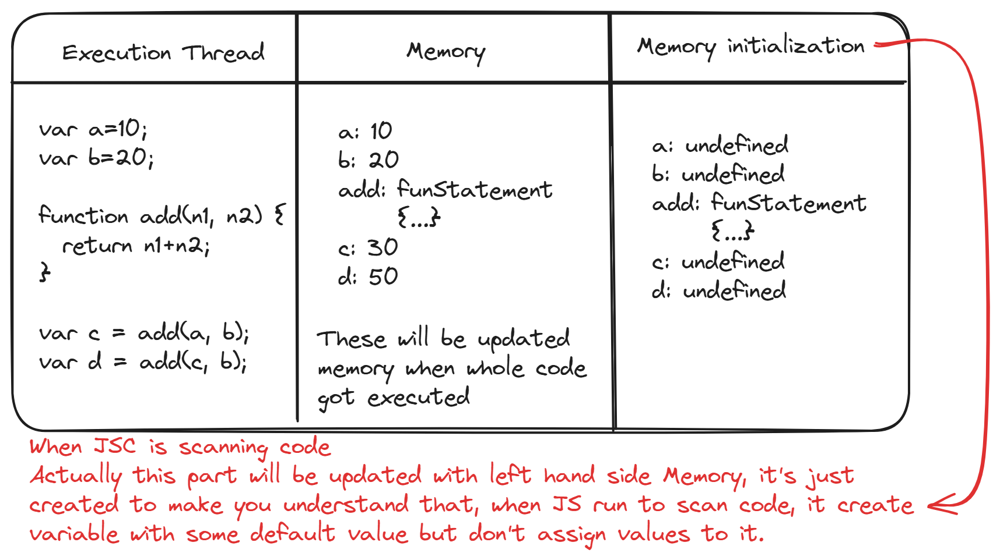
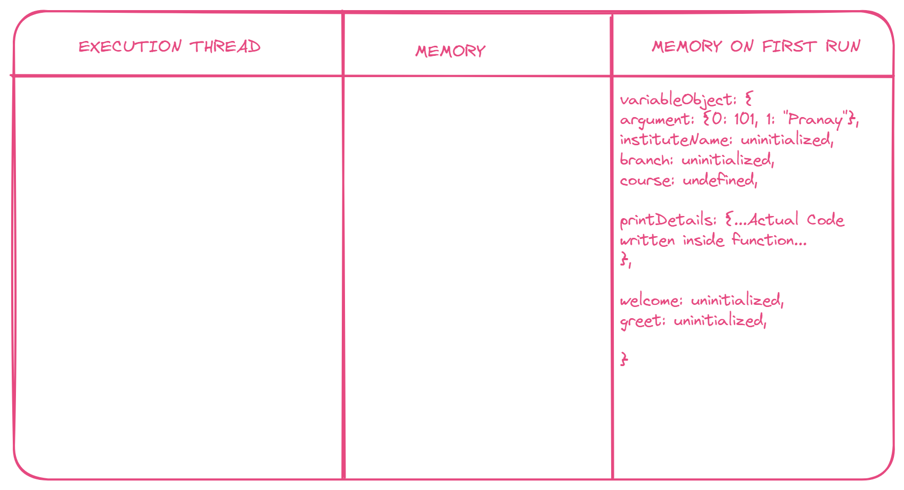

# List of Acronyms

* JS: JavaScript
* JSE: JavaScript Engine
* JRE: JavaScript Runtime Environment

# JavaScript Runtime Environment

JS runtime is an environment which is collection of, necessary components in order to execute JS Code or program.

There are five Component in this
- JavaScript Engine: Examples of JavaScript engines include V8 (used in Chrome and Node.js), SpiderMonkey (used in Firefox), and ChakraCore (used in Microsoft Edge)
	- It's a collection of programs, which is use to run or execute JS Code or program
	- Callstack is a place where JS Code get's executed, with a help of **Execution Context**.
	- **HEAP**: It's a unstructured memory pool or place, which is used to store data structure whose size can be expanded, like **Object, LinkedList, etc**
- WEB API's
	- WEB API's are part of Browser not **PART OF JS**, they use to provide additional functionality to JS, like **fetch, setTimeout(), setInterval()**
- Microtask Queue: It's a data structure, which is used to store callback function, which has higher priority than any other queue and which are waiting inside
- Callback Queue: It's a data structure, which is used to store and run callback function in JS
- Event Loop: It's used to push callback function from Microtask Queue or Callback Queue to **CALL STACK**  

---

## How JS Code Executed by JSE

```js
var a=10;
var b=20;

function add(n1, n2) {
  return n1+n2;
}

var c = add(a, b);
var d = add(c, b);
```

**What JSE Do before Executing Code?**

It first scan whole code to create memory spaces in HEAP and STACK like shown below


For each variable and function. JSE first scan JS code and define some default value to variables and function define in code. value for variable depends upon, which keyword is used to define that variable. Default values for each keyword are `var=undefined`, `let=undefined`, `const=undefined`
- For function defined using **function declaration** initial value is actual function statements written in code
- For **function expression and arrow function** initial value is depends upon keyword of variable (var, const, let) which are used to save these function
When function is called with argument, JSE will create a new execution context and add and object which contain arguments of function

> [!IMPORTANT] EXECUTION CONTEXT
> EXECUTION CONTEXT: It's a container or environment which is used to execute JS code.
> Before every function call a new EXECUTION CONTEXT will be created.
> Every EXECUTION CONTEXT has 2 components or part **Execution Thread** (Code) & **Memory**

> [!TIP] Global Execution Context
> Before executing any line of code, JS Environment will create an **Global Execution Context**

## Execution Context

**Execution Context** is associated with an object, and this object has three properties `variableObject, scope chain, this`
**Is Execution Context is an Object? Yes it's an Object**

### `VariableObject`

Variable Object is a property of, Execution Context. Which contain all the variables, function arguments and Inner Function declaration inner function.
```js
VariableObject = {
 arguments: {...}
 variable: // undefined or un-initialized based on which variable declaration keyword is used.
 functionName: // ...It's Defination..., based on which function is called
}
```

```js
function studentDetails(id, name) {
  let instituteName = "JSpider";
  const batchCode = "M15";
  var course = "MERN";

  function printDetails() {
    console.log(instituteName, batchCode, course);
  }

  let welcome = function () {
    console.log(`Hi,${name}`);
  };

  const greet = () => {
    console.log(`Good Evening: ${id}`);
  };
}

```



---

### Scope Chain

When a JS searches for variable or function from current scope to outer scope, it's known as scope chaining.

> If value is not found in Global Scope also, JSE stop executing code and return `xyz variable is not defined`

```text
block scope -> function scope -> global scope -> Error: X variable is not defined.

let v1 = 10;
function someFunc() {
  let v2 = 20;
  if (true) {
    let v3 = 30;
    console.log(v0, v1, v2, v3); // v0 is not defined it will give error, 10, 20, 30
  }
}
```

**Scopes**: Accessibility of variables and function across program are know as Scope
- **Global Scope**: Top Level Code has Global Scope Top Level Code means variables and function which are not declared inside of Block or Function Scope are knows as Global variables and function
- **Function Scope (Local Scope)**: Variable and function which are declared inside any other Function are knows as local variables and function. These variable and function are only accessible within these functions.
- **Block Scope**: Block started creating scope from from ES6 (ES2015). Variable which are created inside block using `let` or `const` keyword are not accessible outside that block. ***Variable if declared using `var` keyword it is accessible outside Block Scope and if var is defined inside `function`, then it's not accessible outside `function` so var keyword is Function Scope***

```js
function someFunc() {
  if (true) {
    let v1 = 10;
    const v2 = 20;
    var v3 = 30;
    console.log(v1, v2, v3); // 10, 20, 30
  }
  // When ReferenceError will come, program will stop executing.
  console.log(v1, v2, v3); // ReferenceError, ReferenceError, 30
}
console.log(v1, v2, v3); // ReferenceError, ReferenceError, ReferenceError

// ANOTHER EXAMPLE
function a() {
  function b() {
    console.log("b");
  }
  console.log("a");
}
b()

if (true) {
  var c = function () {
    console.log("c");
  };
}
c();

```

- Global Variable - variables which are not defined inside any block or function, are knows as Global Variable. These variables are accessible across the program.
- Local Variable - variables which are defined inside any block or function, are knows as Global Variable

### `this` Keyword

[this keyword](030724-TOD2.md)

---

# Lexical Environment

- Lexical Environment is created for every **execution context** which mean it's created during runtime.
- Lexical Environment is combination of **Local Memory + Reference of current Execution Context's Parent Lexical Environment**

## Lexical Scope !== Lexical Environment

The variables which are created outside the **function** can be accessible within the function is known as Lexical Scope

---

**Now read these topic**

[Closures](030724-TOD1.md)
